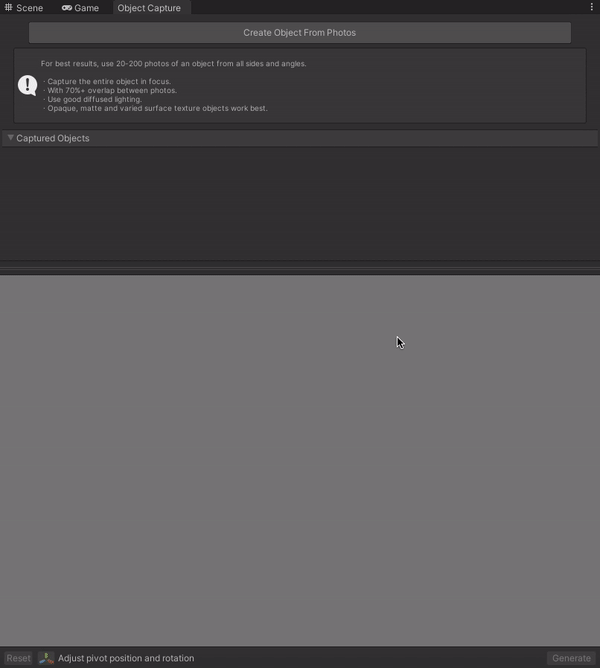

# Introduction
The Object Capture package lets you generate textured 3D models from a set of images.
In this section you will learn about the different parts of the Object Capture window, how to use it, and current limitations of the Object Capture app.

# The Object Capture UI
To open the Object Capture window, use `Window -> Object Capture`. If the option is grayed out please check the [requirements for this package to work](index.md#requirements).

As you can see; the object capture window is divided in four main parts: a *Start Area*, the *Processing Area*, the *Preview area* and the *Adjustment Area*

### 1. Start Area
The start area is where every capture that you want to make starts. By clicking on the *"Create Object From Photos"* button you will get a File Panel window, where you can select the pictures from a folder *and* subsequently you will get a second file panel to select where to save the generated capture in a *.usdz* format. This file can be safely saved outside of the Unity project path.

### 2. Processing Area
After you have selected the pictures you want to reconstruct, in the processing area you will see the object currently being processed and their status.

Note that you can process more than one object at the same time.

### 3. Preview Area
After the processing of your object has been completed the preview area will be filled with a preview generated model. Here you can set up the bounds of the generated preview and adjust the pivot for the transform for the final processed mesh.

In the Preview area, you can tumble the view by dragging with the right mouse button. You can also look at your object from different sides (top, side, front) from the cube buttons in the upper-right.

### 4. Adjustment Area
Finally in the Adjustment Area from left to right you will find the *Reset* button, which lets you reset to the initial view in the preview area, and the *Adjust Pivot* button, which will display a transform handle that you can manipulate to set the pivot for your final model.

Next you will see a dropdown that will let you select the quality for your model. The options are *Preview, Reduced, Medium, and Full*, and finally the *Generate* button that will generate the final model with the values you have previously set up in the preview and adjustment area.

# Generating models with the Object Capture window
The Object capture window works in two steps. First you select the pictures you want to make a model from and generate a preview of the model; *then* you tweak the generated preview by changing the model pivot, crop the mesh to have a cleaner model, and generate the final model.

## Selecting photographs
Click on the *Create Object From Photos* button, which will open a folder panel where you can select the path where your images are stored. 

Subsequently the app will ask you for a name for the generated model; The tool then will generate a *.usdz* file that corresponds to the reconstructed object and also a folder with the same name that ends in *.usdz-extract*. 

**NOTE:** It is important to keep the *.usd-extract* folder. When generating the mesh from the capture in Unity, the USD package will generate a prefab that will have a reference to the extracted folder. While the extracted folder doesn't have to be saved within your Unity project Assets folder, we recommend saving it within your project directory to simplify project and source control management. 

## Tweaking the model
After the model has finished loading in the *Processing Area*, a preview of the model will appear in the *Preview Area*. Here you can tweak the bounding box of the generated model to crop unwanted edges and set the transform pivot for the final model.

You can see how in the picture above that we constrain the toy car to be inside the bounding box, and set the pivot for the transform to be in the front of the car.

## Generating the final mesh reconstruction
After clicking the generate button with the selected model quality in the *Adjustment area*, the model processing will begin. Once complete, you will see the generated model in the preview area, and a prefab of the model highlighted in the project window.

Make sure that your pivot tool is set to `Pivot` and `Local` and notice how the transform pivot is set to the front of the car as pre-selected in the model preview area.

**Note:** If you don't like how the final object reconstruction looks, you can always click on the *Restore Preview* button that appears at the bottom right corner of the *Preview Area* when a generated reconstruction is finished. 

After clicking the Restore Preview button, your object capture will revert to the preview mesh, and you can change/select other reconstruction quality without the need to generate a preview again.

# Generating models with the AR Companion app and Object Capture
If you are taking images for Object Capture through Unity's AR Companion app, you can install the AR Companion Core package along with the Object Capture package.

To load the images taken from the AR Companion App, use *Window &gt; AR Companion &gt; Resource Manager*, navigate to the *Object Capture* section and press the *Create* button to download and subsequently generate an object capture with the [same steps described above](GettingStarted.md#generating-models-with-the-object-capture-window).

**NOTE:** Generated models can only be cropped using an Axis Aligned Bounding Box (AABB). If your model needs to be cropped in another rotation you will have to generate the final model and then subsequently crop the mesh in a third party modeling tool.
