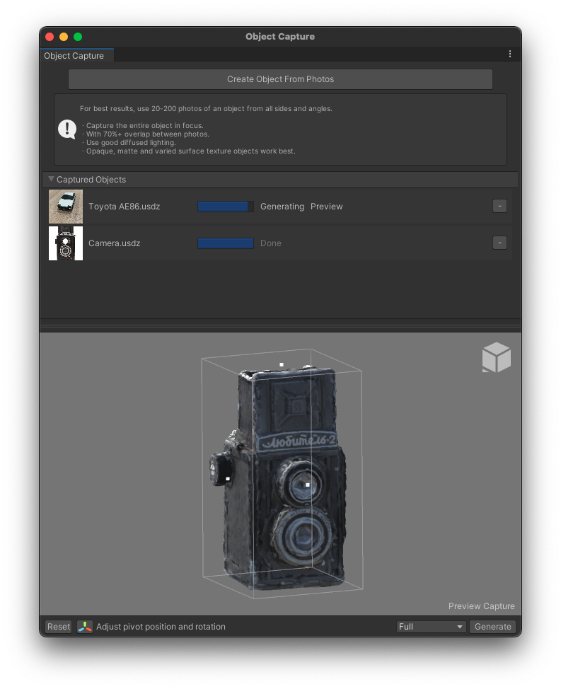

# Introduction
The Object Capture package lets you generate 3D assets from a set of photographs, captured with Unity's AR Companion app or from any set of images.

This documentation covers how to use the Object Capture package, the different parts of the UI, and best practices when generating your 3D captures of real objects.

# Installing the Object Capture Package.
To install this package, follow the instructions in the [Package Manager documentation.](https://docs.unity3d.com/Manual/upm-ui.html)

The Object Capture package uses the Unity *USD* package, and optionally the *AR Companion Core* package for additional import workflows if you using the Unity AR Companion App to capture objects.

# Getting Started
There are two ways of using the Object Capture package:

1) With the Unity AR Companion App and its Object Capture workflow, which will import your image sets through the Companion Resource Window, or

2) Using images from any camera or other source, in which case you will only use the Object Capture window directly.

* [The Object Capture UI](GettingStarted.md#the-object-capture-ui)
* [Generating models with the Object Capture window](GettingStarted.md#generating-models-with-the-object-capture-window)
* [Generating models with the AR Companion app and Object Capture](GettingStarted.md#generating-models-with-the-ar-companion-app-and-object-capture)

# Requirements
As of right now; Unity's Object Capture package only works on *macOS Monterey* and is compatible with the following versions of the Unity Editor:
* 2020.3.20f1 or newer
